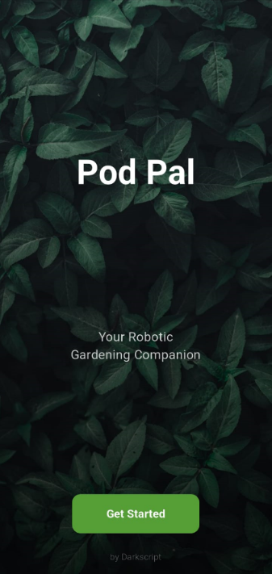
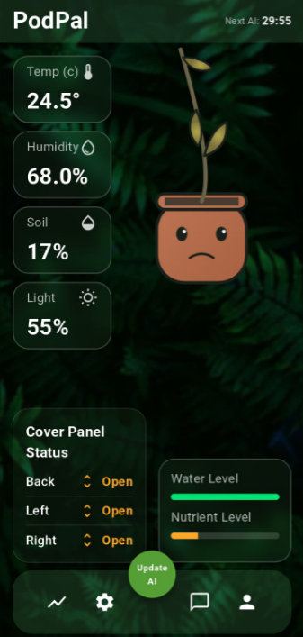
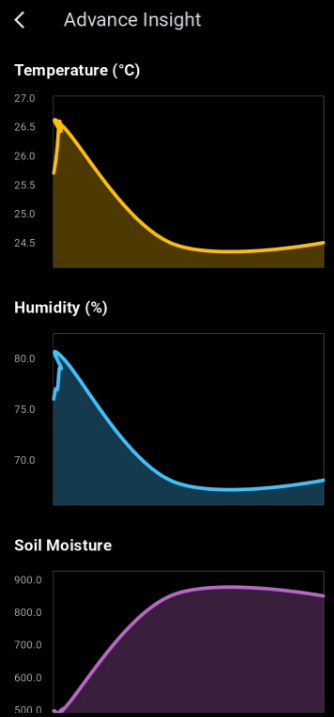
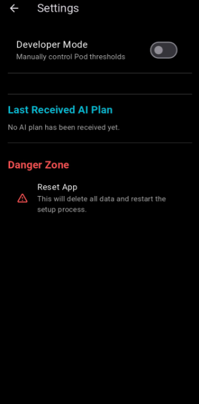
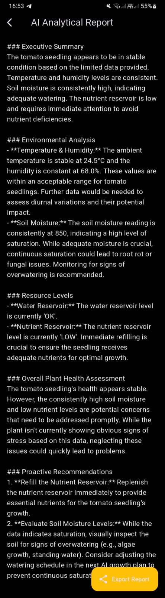
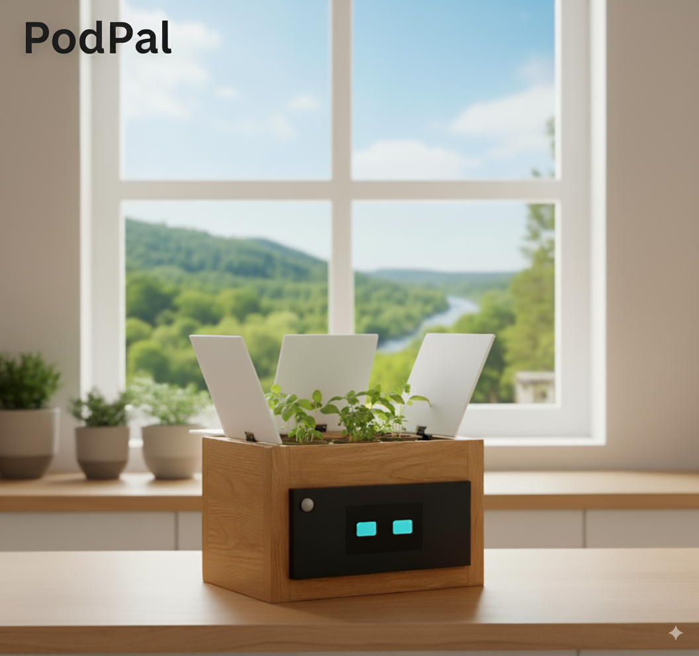

# PodPal - Your AI-Powered Robotic Gardening Companion

> A project by **[Darkscript](https://github.com/darkscript-dev)**

PodPal is a smart plant pod that automates plant care through a closed-loop, AI-driven feedback system. It monitors the environment, sends data to a custom-trained AI, and receives adaptive growth plans to ensure your plants thrive.

### The PodPal Ecosystem
The PodPal experience is delivered through two distinct applications, each designed for a specific purpose:

*   **📊 The Dashboard App (This Repository):** This is your command center. Use it for initial setup, monitoring detailed historical data on charts, and generating AI-powered analytical reports.
*   **😊 The Companion Display (PodFace):** This app provides an at-a-glance, emotional connection to your plant. It runs on a dedicated display (like a tablet) and shows a friendly, animated face that reflects the plant's current state. **[View the PodFace App Repository Here](https://github.com/darkscript-dev/flutter-robot-face)** 

<table>
  <tr>
    <td></td>
    <td></td>
  </tr>
  <tr>
    <td></td>
    <td></td>
  </tr>
</table>

<p align="center">
  <b><i>AI-Powered Analytical Report</i></b>
  <br>
  
</p>

## Features

*   **🤖 AI-Powered Analytical Reports:** Go beyond raw data. Generate detailed daily health reports that analyze environmental trends, provide an expert assessment of your plant's health, and offer proactive recommendations.
*   **🧠 Adaptive Growth Plans:** The "AI Guardian" requests a new, optimized growth plan from Gemini every 30 minutes, using 12 hours of historical data to make intelligent, adaptive decisions about light, water, and climate.
*   **😊 Emotional Companion Display (PodFace):** A secondary app that provides an ambient, at-a-glance emotional connection to your plant, showing if it's happy, thirsty, or sleeping.
*   **📈 Historical Data Visualization:** Track temperature, humidity, soil moisture, and resource levels over time with clean, easy-to-read charts.
*   **🛠️ Full Manual Control:** A "Developer Mode" allows for precise manual control over every hardware component, from light thresholds to nutrient dosing schedules.

## Getting Started

These instructions will get you a copy of the project up and running on your local machine.

### Prerequisites

*   Flutter SDK: [Installation Guide](https://flutter.dev/docs/get-started/install)
*   Android Studio or Visual Studio Code

### Installation

1.  **Clone the repository:**
    ```bash
    git clone https://github.com/darkscript-dev/PodPal.git
    ```
2.  **Navigate to the project directory:**
    ```bash
    cd PodPal
    ```
3.  **Install dependencies:**
    ```bash
    flutter pub get
    ```
4.  **Set up your Gemini API Key:**
    *   Create a new file named `.env` in the root of the project.
    *   Add the following line to the `.env` file, replacing `YOUR_API_KEY` with your actual Gemini API key:
        ```        GEMINI_API_KEY=YOUR_API_KEY
        ```

5.  **Run the app:**
    *   **VS Code:** A pre-configured launch profile named "PodPal (.env)" is included. Select it from the "Run and Debug" panel and press the play button.
    *   **Android Studio:** A shared run configuration is included. It should be selected by default. Simply press the green "Run" button.

## Project Structure

*   `lib/api`: Contains services for interacting with external APIs (Gemini, Pod hardware) and the local database.
*   `lib/models`: Defines the data models used throughout the application.
*   `lib/providers`: Manages the application's state using the Provider package.
*   `lib/screens`: Contains the UI for each screen of the application.
*   `lib/widgets`: Contains reusable UI components.

## Hardware Firmware & Architecture

The PodPal hardware operates on a dual-microcontroller architecture to separate tasks efficiently.

### Arduino Due (Sensor Hub)
This microcontroller is directly connected to all sensors and actuators. Its sole responsibility is to manage the plant's immediate environment based on the active thresholds. The code for the Due can be found in the `/arduino/DVE_R3_The_Sensor_Hub` directory.

#### Hardware Components
*   Arduino Due (or compatible)
*   ESP8266 (for Wi-Fi)
*   DHT11 Temperature and Humidity Sensor
*   Soil Moisture Sensor
*   Light Dependent Resistors (LDRs)
*   Servos
*   Water Pump
*   Fan
*   Grow Light

### ESP8266 (Wi-Fi Bridge)
This microcontroller acts as a communication bridge between the Flutter app and the Arduino Due. The project is structured to easily incorporate it in the `/arduino/esp8266_wifi_bridge` directory once ready.

## Future Roadmap

We are passionate about the future of PodPal.we plan to evolve our current prototype into a fully integrated, self-contained product.



Our key development goals include:

*   **➡️ Integrated Companion Display:** Embed a Raspberry Pi and LCD screen directly into the PodPal, creating the elegant, all-in-one device shown in the concept image above.
*   **📷 Camera Integration with Gemini Vision:** Integrate a camera to allow the AI to visually monitor plant health, detect disease, and identify growth stages automatically.
*   **☁️ Cloud Dashboard for Researchers:** Create a web platform for the lab/greenhouse market, allowing them to manage and analyze data from a fleet of PodPals in real-time.
*   **🌱 Community-Sourced Growth Plans:** Allow users to share and download proven AI-generated growth plans for different types of plants.

## Contributing

Contributions are what make the open-source community such an amazing place to learn, inspire, and create. Any contributions you make are **greatly appreciated**.

If you have a suggestion that would make this better, please fork the repo and create a pull request. You can also simply open an issue with the tag "enhancement".

1.  Fork the Project
2.  Create your Feature Branch (`git checkout -b feature/AmazingFeature`)
3.  Commit your Changes (`git commit -m 'Add some AmazingFeature'`)
4.  Push to the Branch (`git push origin feature/AmazingFeature`)
5.  Open a Pull Request

## Acknowledgments

*   A huge thank you to **[MihirangaDissanayake](https://github.com/MihirangaDissanayake)** for developing and providing the complete Arduino code for the sensor hub.
*   This project was built using [Flutter](https://flutter.dev/), [Google Gemini](https://ai.google.dev/), and [Arduino](https://www.arduino.cc/).

## License

Distributed under the MIT License. See `LICENSE` for more information.